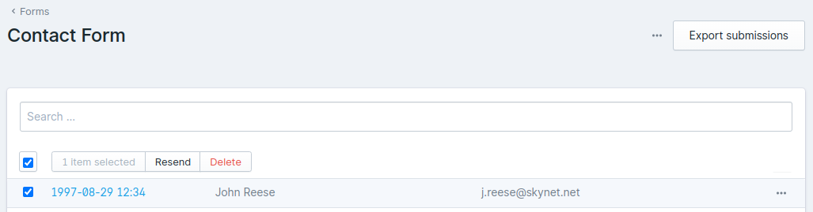

# Statamic Resend Form Submissions

> Resend Form Submissions is a Statamic addon for resending form submissions.



## How to Install

You can search for this addon in the `Tools > Addons` section of the Statamic control panel and click **install**, or run the following command from your project root:

``` bash
composer require oaked/statamic-resend-form-submissions
```

## How to Use

Go to the form submissions and select the item(s) you want to resend.

### The resend button is not there?

The module also checks if the form have an e-mail configured. When empty the button is not visible.